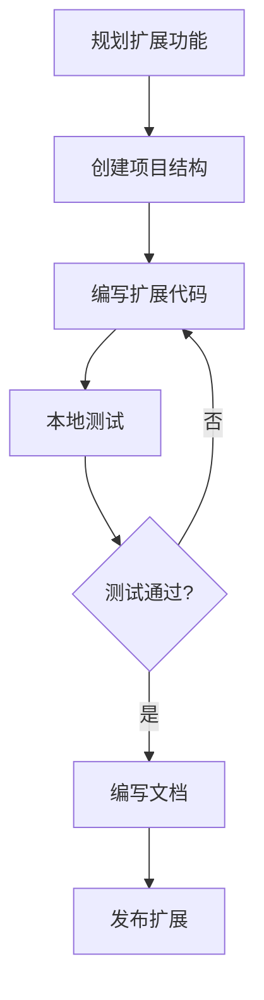

# 1.1 Scratch 扩展简介

Scratch 扩展是扩展 Scratch 功能的重要方式，允许开发者创建自定义积木块，连接外部硬件、API 服务或实现特定功能。

## 什么是 Scratch 扩展？

Scratch 扩展是一组自定义积木块的集合，可以：

- 连接外部硬件设备（如 micro:bit、LEGO 等）
- 调用外部 API 服务（如翻译、天气等）
- 实现特定领域功能（如机器学习、数据分析等）
- 扩展 Scratch 内置功能

## 扩展类型

### 1. 官方扩展

Scratch 官方提供的扩展，包括：

| 扩展名称 | 功能描述 |
|---------|---------|
| Music | 演奏音符和乐器 |
| Pen | 绘制图形和图案 |
| Video Sensing | 视频运动检测 |
| Text to Speech | 文字转语音 |
| Translate | 翻译文本 |
| micro:bit | 连接 micro:bit 开发板 |

### 2. 自定义扩展

开发者自行创建的扩展，可以：

- 发布到 Scratch 扩展库
- 通过 URL 加载使用
- 本地开发和测试

## 开发环境准备

### 必备工具

```bash
# 1. 安装 Node.js（推荐 LTS 版本）
# 访问 https://nodejs.org/ 下载安装

# 2. 验证安装
node --version
npm --version

# 3. 安装 Git
# 访问 https://git-scm.com/ 下载安装
git --version
```

### 开发目录结构

```
my-extension/
├── src/
│ └── index.js # 扩展主文件
├── test/
│ └── index.test.js # 测试文件
├── package.json # 项目配置
├── README.md # 说明文档
└── .eslintrc.js # ESLint 配置
```

## 第一个扩展

创建一个简单的 "Hello World" 扩展：

```javascript
// src/index.js

/**
 * Hello World 扩展示例
 * 展示 Scratch 扩展的基本结构
 */
class HelloWorldExtension {
 /**
 * 扩展构造函数
 * @param {object} runtime - Scratch 运行时对象
 */
 constructor(runtime) {
 this.runtime = runtime;
 }

 /**
 * 扩展的唯一标识符
 * 必须与 package.json 中的名称一致
 */
 static get EXTENSION_ID() {
 return 'helloWorld';
 }

 /**
 * 扩展的显示信息
 */
 getInfo() {
 return {
 // 扩展 ID
 id: HelloWorldExtension.EXTENSION_ID,
 
 // 扩展名称（显示在积木块分类中）
 name: 'Hello World',
 
 // 扩展颜色（HSV 格式）
 color1: '#FF6680',
 color2: '#FF4D6A',
 color3: '#FF3355',
 
 // 扩展图标（SVG 格式）
 blockIconURI: 'data:image/svg+xml;base64,...',
 
 // 积木块定义
 blocks: [
 {
 // 积木块操作码
 opcode: 'sayHello',
 
 // 积木块类型
 blockType: Scratch.BlockType.REPORTER,
 
 // 积木块文本
 text: '说你好给 [NAME]',
 
 // 参数定义
 arguments: {
 NAME: {
 type: Scratch.ArgumentType.STRING,
 defaultValue: '世界'
 }
 }
 }
 ]
 };
 }

 /**
 * sayHello 积木块的实现
 * @param {object} args - 积木块参数
 * @returns {string} - 返回问候语
 */
 sayHello(args) {
 const name = args.NAME || '世界';
 return `你好，${name}！`;
 }
}

// 导出扩展
module.exports = HelloWorldExtension;
```

## 扩展加载方式

### 1. 本地加载

在 Scratch 中通过 URL 加载本地扩展：

```javascript
// 在浏览器控制台中执行
Scratch.extensions.register(new HelloWorldExtension());
```

### 2. TurboWarp 加载

TurboWarp 支持自定义扩展加载：

1. 打开 TurboWarp 编辑器
2. 点击 "添加扩展"
3. 选择 "自定义扩展"
4. 输入扩展的 URL 或粘贴代码

### 3. Scratch 3.0 开发环境

```bash
# 克隆 Scratch 3.0 仓库
git clone https://github.com/LLK/scratch-vm.git
cd scratch-vm

# 安装依赖
npm install

# 添加自定义扩展
# 将扩展文件放入 src/extensions/ 目录

# 启动开发服务器
npm start
```

## 扩展开发流程



## 最佳实践

### 1. 命名规范

```javascript
// 推荐：使用清晰的命名
opcode: 'getWeatherTemperature' // 获取天气温度

// 不推荐：模糊的命名
opcode: 'getData' // 获取数据（太模糊）
```

### 2. 参数验证

```javascript
/**
 * 带参数验证的积木块实现
 */
calculateArea(args) {
 // 验证参数类型
 const width = Number(args.WIDTH);
 const height = Number(args.HEIGHT);
 
 // 错误处理
 if (isNaN(width) || isNaN(height)) {
 return 0; // 返回默认值
 }
 
 // 确保参数有效
 const safeWidth = Math.max(0, width);
 const safeHeight = Math.max(0, height);
 
 return safeWidth * safeHeight;
}
```

### 3. 国际化支持

```javascript
getInfo() {
 return {
 // ...
 blocks: [
 {
 opcode: 'sayHello',
 blockType: Scratch.BlockType.REPORTER,
 // 使用消息 ID，支持多语言
 text: {
 'zh-cn': '向 [NAME] 问好',
 'en': 'say hello to [NAME]'
 },
 arguments: {
 NAME: {
 type: Scratch.ArgumentType.STRING,
 defaultValue: {
 'zh-cn': '世界',
 'en': 'World'
 }
 }
 }
 }
 ]
 };
}
```

## 小结

本章要点：

1. **扩展概念**：理解 Scratch 扩展的作用和类型
2. **开发环境**：搭建扩展开发所需的工具和环境
3. **基本结构**：掌握扩展的基本代码结构
4. **加载方式**：了解扩展的不同加载方式

> **提示**：Scratch 扩展开发需要一定的 JavaScript 基础，建议先熟悉 JavaScript 语法。

## 练习

1. 搭建 Scratch 扩展开发环境
2. 创建一个简单的 "Hello World" 扩展
3. 尝试在 TurboWarp 中加载并测试你的扩展
